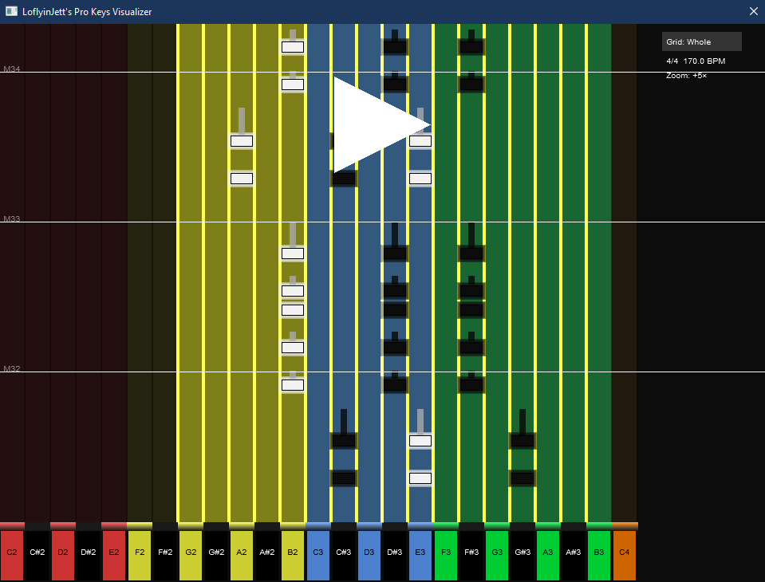

# LoflyinJetts Pro Keys Visualizer

🎹 A Rock Band-style MIDI keyboard visualizer for REAPER — designed for helping people visualize their rhythm game custom songs featuring Pro Keys charts.

---

##  Features

- **Piano Roll Highway** – smooth vertical note scroll with time-synced playback.
- **Rock Band-Style Notes** – chunky rectangular notes and sustain tails.
- **Glowing Outlines** – visual clarity even with heavy note clusters.
- **Overdrive Awareness** - Notes visually glow to indicate when a note is authored for Overdrive.
- **Keyboard Range Detection** – reacts to RB range notes on MIDI notes 0, 2, 4, 5, 7, 9 to define playable ranges.
- **Range Shift Arrows** – animated arrows prep you for upcoming range shifts before the change.
- **Lane Dimming** – notes outside the active range are subtly dimmed with a shadow overlay.
- **Zoom with Mouse Wheel** – control scroll speed interactively.
- **Resizable UI** – reacts to window size with proper scaling.
- **Measure + Grid Lines** – supports multiple grid resolutions (1/4, 1/8, etc.).

---

## Requirements

- **REAPER 7+** (May work on other versions but this is untested)
- **Python 3+** (May work on other versions but this is untested)
- Lua scripting enabled in ReaScript

---

## Installation

1. Download the latest version
2. In REAPER:
   - Go to `Actions > ReaScript > Load`
   - Choose the `.lua` file
   - Run it from the Action List
   - Optionally add a keybind for quick recall of the window

---

## Controls

- **Scroll Wheel** – zoom highway view in and out
- **Playback Sync** – follows playhead or cursor
- **Displays whatever MIDI track you currently have selected

---

## Credits

- Developed by LoflyinJett
- Special thanks to the REAPER scripting community
- Harmonix for making an awesome game with a still thriving community

---

## Support Future Work

If you found this useful or inspiring:

Buy me a coffee! - https://buymeacoffee.com/loflyinjett

---

## License

MIT License – use freely, remix, and contribute!

---

## Demo Video
[LFJs Pro Keys Visualizer V2.5 Demo Video.webm](https://github.com/user-attachments/assets/3ad60f78-c1d6-4a2d-b7ac-ee6157041b70)
